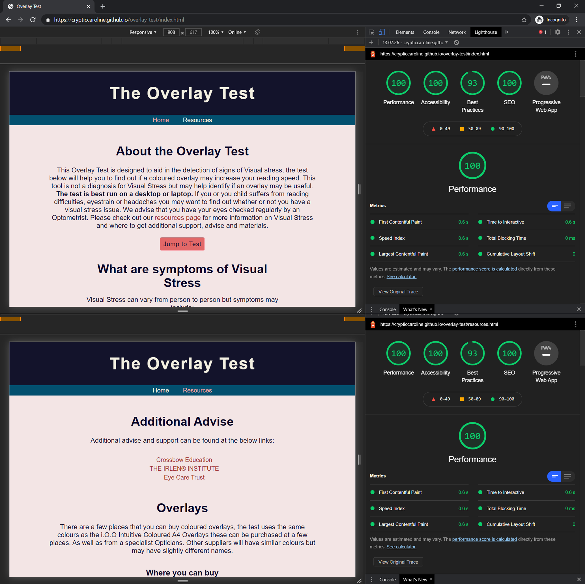

# Overlay Test

[Link to Live Website](https://crypticcaroline.github.io/overlay-test/index.html)

[GitHub Repo](https://github.com/crypticCaroline/overlay-test)

*** 

## About  
Visual Stress is a common condition that affects an estimated 20% of the population.  This causes issues in the visual cortex of the brain which is commonly experienced by people with dyslexia.  Visual stress however is an entirely separate and distinct condition.  Not all people with dyslexia will suffer from Visual stress and not all people with Visual Stress will be dyslexic.   Visual Stress comes in a variety of symptoms including : 
*   Headaches
*   Blurring of print
*   Noticing white "rivers" running down the page. The white background stands out more than text above it.
*   Losing place within text, skipping words or lines
*   Words appearing to move or jump
*   Eyestrain
*   Difficulty in understanding the text being read
*   Glare on page

Research over the last 20 years has show that using a coloured filter can alleviate the symptoms and increase reading speed by up to 38%. 
As a sufferer of Visual Stress and Dyslexia myself I wanted to create a short test that may indicate if a user has Visual Stress and may benefit from the use of a coloured overlay. It was not until I was working in an optician when I was explaining the symptoms of Visual Stress to a patient that I started to wonder whether my own reading issues were caused by Visual stress.  Since being tested I have found a vast improvement with both Coloured Overlays and Colorimetry glasses.   

Currently there is a small choice of online overlay test most of which are basic.   Most involve a start stop timer to measure how long it takes to read a passage, the test can be taken multiple times, but the text passage is the same throughout.  This could lead to test bias as the user starts to memorise the first few lines.   Other options I have found simply demonstrate what it looks like to have an overlay over the text.  Some of these options change the background colour rather than the overlay colour, which yields a different optical result.  

This test does not replace testing done by Optical professionals but may prove a useful tool for users who do not often see an Optometrist or users who may not have considered getting tested. 

## Index – Table of Contents

* [User Experience (UX)](#user-experience) 
* [Features](#features)
* [Designs](#designs)
* [Technologies Used](#technologies-used)
* [Testing](#testing)
* [Known Bugs](#known-bugs)
* [Deployment](#deployment)
* [Acknowledgements](#credit)

*** 

## User Experience (UX)

## Strategy
### User Stories  

#### Reasons a user may visit the website
* Doing research on visual stress either for themselves of for a family member
* Experiencing symptoms of visual stress and want to test themselves / child
* Trying to find out if using an overlay may increase their reading speed

#### Reasons for the website
* Provide information to users about what visual stress is and how to get additional help
* Provide a way of testing for signs of visual stress
* To demonstrate what it looks like to use an overlay
* Spread awareness of visual stress to a wider group of people. 
  

## Scope
#### What a user may expect
* Easy to navigate website
* Good presentation and visually appealing
* Links and functions work as expected
* Users to find information about visual stress
* Have a way to test for visual stress

#### What a user may want 
* A way to check different coloured overlays
* A way to record down scores
* Information about places that offer additional services
* A way to receive their results
* Information about what their results mean 
* To be able to buy overlays
* A way to contact the the company to ask further questions

#### As a developer / business I expect
* To provide an easy to use website
* To give users useful information about visual stress
* To provide a way for users to test to see if they could benefit from an overlay
* To provide the results and be able to send them to the user
* To signpost users to other resources that may be benefical for them 

## Structure

***
The website will consist of two pages:

The homepage which will consist of the test, some information on visual stess, results and results advise. 
The resources page will include links to places to buy overlay and get additional advise and support. The resources page with be fairly small to start with but with space and scope to be able to add more features like "Find your local specalist". 

## Designs

## Surface

#### Colour

The colours I have used in the design are a mixture of two shades of blue and two shades of pink.   
I have opted not to use red and green as this can be difficult for people that have a colour deficiency to see.  I used an off-white colour for the text on the dark background in the header and footer to make it stand

I have used black on white text in the testing area.  This is because black writing on a white background can cause the worst symptoms of visual stress.   So, for the purpose of testing for signs of visual stress we want to create an environment where they are most likley to be present. 

I have used another shade of pink for the link hovers. 

I got inspiration for my colour pallete from [Coolors](https://coolors.co/palettes/trending)

#### Typography 

I have chosen to use a font from [Google fonts](https://fonts.google.com/)  I have used Poppin.  This font is a sans serif font which means it does not have decoration at the end of the letter.  This can cause issues with readability seen in serif fonts.  The Poppins font is fun and playful, and offers nice spacing between the letters as standard.   

I have used the default serif font for the test.  This is to encourage signs and symptoms of visual stress to show when taking the test. 

For the headings I have increased the letter spacing to make it stand out. 

I imported using the the following code at the top of my style.css file: 

        @import url('https://fonts.googleapis.com/css2?family=Poppins:wght@200;300;400;&display=swap');

#### Call to Action

* For the buttons and links (styled as buttons)  I have changed the opacity on hover.  This is to show the user that the button can be clicked. 

* I have used changed the colour of the text for the links in the main text to a dark pink colour, on hover the word goes blue  This lets the user know the link can be clicked. 

* In the test each word is contained within a span, this then changes when the word is hovered over after the test has run. When the test is live or not running you can not click on the word.  This is so the user doesn't get confused whilst taking the test.  

* On the input fields I have used a pointer event to encourage the user to enter a value.  

### Imagery   

I have used an example of visual stress in the main page.  I designed this using  [Microsoft Word](https://www.microsoft.com/en-gb/microsoft-365/word) to give a visual demonstration of what symptoms of visual stress may look like.  This would be particully helpful to teachers or parent running the test with a child.  

***

## Skeleton 

### Layout 

I have used responsive design when creating the testing site.I have also set a Max-Width for the site so on very large screens the content stays neat and is well formatted.
The test runs best on larger screens but will also work on a mobile.  Even though the test is designed for bigger devices I have designed the site mobile first.  As the window is expanded everything is neat and sits in line.  

I have styled containers and added padding and margins to ensure that the content it not too close together and everything can be seen clearely. 

#### Homepage Wire Frame 

#### Resources Wireframe

***

### Mockup
#### Home Page

#### Resources Page

***

## Features

#### Universal Features Across the Site

###### Logo and Navigation Bar
The Navigation Bar is at the top of the webpage. The logo and nav links all change colour when they are hovered over. The active page is set to pink so the user knows what page they are on.  The nav links direct the user to the correct page of the website. When the logo is clicked on it will take the user to the home page. 

###### Responsiveness

The website is fully responsive between different screen resolutions.  I have done this by using media queries.  I have changed the width and included content within containers so that everything stays neat and in the correct order. 

###### Accessibility

* I have been careful to set all fonts in rem so that if the user has set their setting to a larger size the website will cater for this.  
* There is high contrast throughout to make the site easy to use. 
* I have used a sans serif font for the body of the website to ensure readability for users who have visual stress or issues with reading serif fonts.  
* All headings are in desending order to make the page easier for a screen reader.  
* The test it self is not very suitable for a screen reader, this is because the test is designed for users to asses their reading speed.  
* With this release you have to click on the word in order to get your results.  In future version it would be good to add the ability to use a key press as well for users unable to opperate a mouse. 

###### Input Fields 

* The email input fields are type specific, so will need to have a valid email and text, they are also set to be required in order for the user to submit. 
* The calculator is number specific so users can not enter anything other than a number. 

###### Footer 

The Footer is split into three sections, an opening hours, copyright and contact. Although this is a testing website rather than a buisness users may want to get in contact with the website developers to let them know of any bugs or to ask questions about visual stress.   

##### Meta data

I have added keywords, author and description to the meta data to make the website easier to find.  This increases traffic to the website.  I have also given each page a different name so the user knows which tab they are on. 

##### Redirect

I have added a generic 404 page with a small amount of styling.  I have written the Java Script directly into the html so that there is no delay in redirecting the user.  

*** 

#### Features Specific to Pages

###### The Test 

The overlay is situated at the bottom of the webpage underneath some important information about visual stress.  There is a jump to test button at the bottom of the opening paragraph for users who wish to skip straight to the test.   Inside the test box are the instructions of how to carry out the test. The user can change the colour of the overlay using the buttons above the box. 

When the user presses the start button underneath the test box:

* The instructions are removed and a randomly generated paragraph of predefined words appear. 
* A 30 second timer is started and the count down is indicated above the text. 
*   If the user presses the stop button this clears the timer. If the user clicks the see instructions button this will clear the timer and reshow the instructions. 
* At the end of the timer the user is asked to stop and to click the last word they read.  The text is highlighted in blue to make it more apparent to stop.  
*  When the users mouse hovers over each word the background changes, this makes it easier for the user to see the word they are selecting. 
*  The user it shown their result and a delayed alert is displayed letting the user know their result has been added to a table. 
* A table is construsted the first time the test is run and all results are appended to the table below the test. 
* The user can have their results emailed to them using email.js when they fill out their details into the input field. 
* I have also used a calculator for the user to work out the wordspeed increase. To see whether using a coloured overlay may be benefical.  - this is not emailed to the user but could be a future feature.  

###### Email

I have used [EmailJS](https://www.emailjs.com/) to send the email to the user.  This takes parameters defined in the contact.js file and the parameters set within the email template.  When the user clicks send email after they have submitted their details.  The email gets the data by using a loop to iterate through the results to create a string and pass the user all the results that they had.  

###### Calculator

The calculator works out whether there has been a change to the reading speed from a baseline score.  The user can use this calculator as many times as they would like.  Below the calculator is some advise about what there % could mean and how they can get additional help and resources. 

If the user doesn't enter anything into the input fields they will get a message saying to put numbers into both boxes.  

### Future Features 

* Calculator result are also sent.  This could work by the user entering a baseline test and then the results table working out the reading % for each of the results. 
* The user could buy Overlays direct from the website. 
* Add the ability to use a keypress to select a word instead of a mouse button for improved assesbility.
* Resources page has a find your specalist section using an api such as google maps. 
    

***

## Technologies Used 

* HTML5 - Mark-up language using semantic structure.
* CCS3 - Cascading style sheet used to style.
* JavaScript - Programming language.  
* Gitpod.io - for writing the code. Using the command line for committing and pushing to Git Hub
* GitHub - hosting repositories
* GIT - Pushing code to repositories
* [EmailJS](https://www.emailjs.com/)
 
Design 

* [Google fonts](https://fonts.google.com/)  - for the font
* [Balsamiq wireframe](https://balsamiq.com/)  - for creating the wireframes
* [Beautifer](https://beautifier.io/) - for helping to keep code tidy
Testing 
* [HTML Validator](https://validator.w3.org/) - checking the validity of code
* [CSS Validator](https://validator.w3.org/) - checking the validity of code
* [JSHint](https://jshint.com/)- Testing and checking JS.  - checking for errors in code
* [Am I Responsive](http://ami.responsivedesign.is/#) - checking whether the site is responsive. 
* [Wave](https://wave.webaim.org/) 
* DEV Tools - Lighthouse

***

## Testing 
    
[HTML Validator](https://validator.w3.org/) 

Passed with no warnings on both pages

[CSS Validator](https://jigsaw.w3.org/css-validator/#validate_by_input)

Passed with warning using root colours, opted to keep as makes changes colours across the page much easier.

[JSHint](https://jshint.com/)- Testing and checking JS. 

No major warnings

### Usability Testing

When deployed I had friends and family check the userbility of the website.  
On first testing a user commented that they wanted to know when the test was running.  I added the stop start classes to the start button to display that the test was live. 

A user commented that it would be nice to know how long was left on the test.  As a result I added the countdown to the test to allow the users to know how much longer they had. 

Originally I had the user stop the test using an alert.  While this functioned okay on desktop it blocked out the text on mobile devices, this made it difficult to rememeber what word was reached.  I change this to be a message above the text and added a coloured band to make it more obvious to stop.  

A user tried to use Internet Explorer for the test and this would not work. Please see compatability testing for more information.  

To ensure assesbility I ran the website through [Wave](https://wave.webaim.org/).   This showed that the contrast was not strong enough for links.  I changed the colour to a darker pink and on hover to blue to make it easier to see.
    
### Browser Compatibility

Tested on Chrome, Firefox, Brave, Internet Explorer, Microsoft Edge, Safari.

When using Internet Explorer the test doesn't run, the buttons are not build and the colour scheme is not shown. This is because Internet Explorer is not compatiable with some of the latest JavaScript and CSS releases.  I have added a message at the bottom of the instructions to let users know to use an alternative browser to run the test.  In  a future releases of the project given more time I would like to make the test compatiable with Internet Explorer

### OS Compatibility
 iOS, Android 10, and Windows 10. -
Tested for responsiveness using Chrome DevTools. Runs well on both IOS and Android 10. 

### Performance Testing
Tested on the Developer Tools Lighthouse.  

I used Lighthouse last in my testing to check for final things to improve and make sure eveything was working well.  I had not added rel= noopeners to my resources page, Dev Tools highlighted this and I made the adjustment. 

 
*** 

### Testing User Stories

* *Doing research on visual stress either for themselves of for a family member* - users can find some basic information about visual stress on the main homepage and further links on the resources page
* *Experiencing symptoms of visual stress and want to test themselves / child*- users can test for signs of visual stress using the test. 
* *Trying to find out if using an overlay may increase their reading speed* - users can select different colours overlays to see if they make a difference to their reading speed. 

What a user may have wanted 

* *A way to check different coloured overlays*  - using buttons above the test
* *A way to record down scores* - build into the table as the test is carried out 
* *Information about places that offer additional services* - more information on the resources page and sign posted in the advise columns at the bottom of the page
* *A way to receive their results* - an email is sent to the user when fields filled out. 
* *Information about what their results mean*  - adivse in the columns at the bottom of the page
* *To be able to buy overlays* - not through the website but links provided in resources, could be a future feature.
* *A way to contact the the company to ask further questions* - contact info supplied in the footer

*** 

## Deployment 

### Adding and Committing files

To add files to the repository take the following steps

In the command line type -
        git add .  
        git commit -m "This is being committed"
        git push

To add all new files or modified file use " ."  - To add a single file use the pathway to the file eg .index.html  or assets/css/style.css
When committing make sure your comments are clear about what changes have been made. 
Pushing will send your work to the repository

### Deployment 

The project was deployed with the following steps

* Logged into git hub
* Clicked the "Settings" button in the menu above the Repository.
* Scroll down the Settings page to the "GitHub Pages" Section.
* Under "Source", click the dropdown called "None" and then select "Master Branch".
* The page will automatically refresh, and a link displaced.  It may take some time for the link to show the website.
* If the page will not load go down to "template" under the "source" and select a template. 
* Scroll back down through the page to locate the now published site link in the "GitHub Pages" section.

### Forking

Forking the GitHub Repository

By forking the GitHub Repository, you can make a copy of the original repository in your own GitHub account.  This means we can view or make changes without making the changes affecting the original.

* Log into GitHub and locate the GitHub Repository.
* At the top of the Repository there is a "Fork" button about the "Settings" button on the menu.
* You should now have a new copy of the original repository in your own GitHub account.

### Cloning 

Making a Local Clone

* Log into your GitHub then find the gitpod repository
* Under the repository name there is a button that says "Clone or download". Click on this button.
* If cloning with HTTPS "Clone with HTTPS", copy this link.
* Open Gitbash
* Change the current working directory to the location where you want the cloned directory to be.
* Type git clone, and then paste the URL you copied earlier.

        $ git clone https://github.com/YOUR-USERNAME/YOUR-REPOSITORY
        Press - Enter- Your local clone will be created.
        $ git clone https://github.com/YOUR-USERNAME/YOUR-REPOSITORY
                > Cloning into `CI-Clone`...
                > remote: Counting objects: 10, done.
                > remote: Compressing objects: 100% (8/8), done.
                > remove: Total 10 (delta 1), reused 10 (delta 1)
                > Unpacking objects: 100% (10/10), done.
[Click Here](https://docs.github.com/en/free-pro-team@latest/github/creating-cloning-and-archiving-repositories/cloning-a-repository) for more info on cloning. 

## Known Bugs 

* The test was building less than 300 words when it skipped a word. FIX if the word is skipped it adds 1 back to totalWords.  This mean there will always be 300 words displayed. 

***

## Acknowledgements

### Credit

* Brian Macharia- Mentor support, guidance, tips, and key things to look out for throughout the project. Helping me to check for errors and looking at my code. 
* Anthony Lomax - for testing and reporting any bugs.  For helping me figure out how to use EmailJS parameters effectively, for also being my soundboard when trying to troubleshoot errors. 
* Callum Hewitt - Having a look at code and making some best practice suggestions.
* Josie Evans - for testing the website from an opticians point of view and making suggestions on how I could make the website work better for real life users. 
* Rob Beaney - for testing and minor styling suggestions.  
* Harry Smith - Checking use on mobile devices.
* David Savage - Testing usability. 
* Matt Rudge - Template for gitpod.io 
* [Code Institute SampleREADME](https://github.com/Code-Institute-Solutions/SampleREADME)
* [Code Institute README Template](https://github.com/Code-Institute-Solutions/readme-template)
* [W3schools](https://www.w3schools.com/) - for various code information and trouble shooting.
* [Google fonts](https://fonts.google.com/) - CDN for the fonts were used in the project.
* [Balsamiq wireframe](https://balsamiq.com/) - To build wireframes in the design phase. 
* [HTML Validator](https://validator.w3.org/) - Testing validity of HTML.
* [CSS Validator](https://jigsaw.w3.org/css-validator/#validate_by_input) -Testing validity of CSS.
* [JSHint](https://jshint.com/)- Testing and checking JS. 
* [Am I Responsive](http://ami.responsivedesign.is/#) - Checking the responsive nature.
* [Beautifer](https://beautifier.io/) - Allowing me beautify my code.
* [HTML Online](https://html-online.com/articles/smart-404-error-page-redirect/) - Redirect page Inspiration
* [Coolors](https://coolors.co/palettes/trending) - colour inspiration

*** 

### Code:

Code taken from EmailJS to initialise and to send emails : 
        <scripttype="text/javascript"src="https://cdn.jsdelivr.net/npm/emailjs-com@2/dist/email.min.js"></script>
        <scripttype="text/javascript">
        (function() {
        emailjs.init("user_5I77sqs4w8AR9K52gjkiC");
        })();
        </script>

Code example used and modified for needs :
    var templateParams = {
    name: 'James',
    notes: 'Check this out!'
    };
 
    emailjs.send('YOUR_SERVICE_ID', 'YOUR_TEMPLATE_ID', templateParams)
        .then(function(response) {
        console.log('SUCCESS!', response.status, response.text);
        }, function(error) {
        console.log('FAILED...', error);
        });    

### Content:

Code & Content (not already attributed): Rebecca Kelsall

### Inspiration: 

[ReadEz](https://www.readez.co.uk/aaa-overlay-test/)
[Cargill Opticians](https://www.cargillsopticians.co.uk/our-services/specialist-services/i-o-o-institute-of-optometry-coloured-overlay-test/)
[Colour2C](http://www.colour2c.co.uk/Example_Aqua.htm)
[Read 123](https://www.read123.co.uk/en/online-visual-dyslexia-visual-stress-test/)

