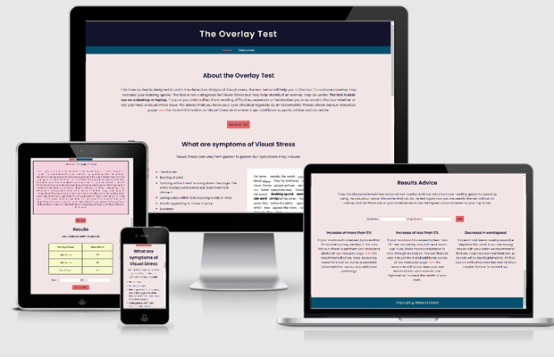
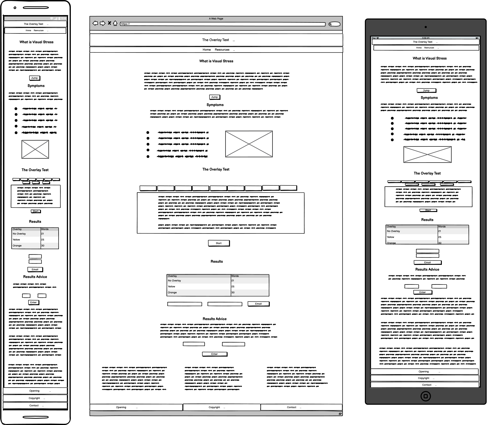
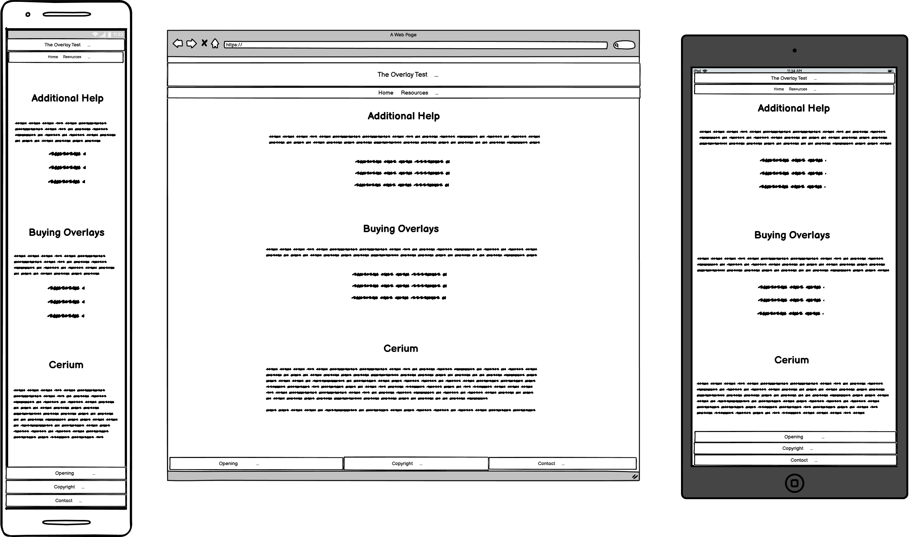
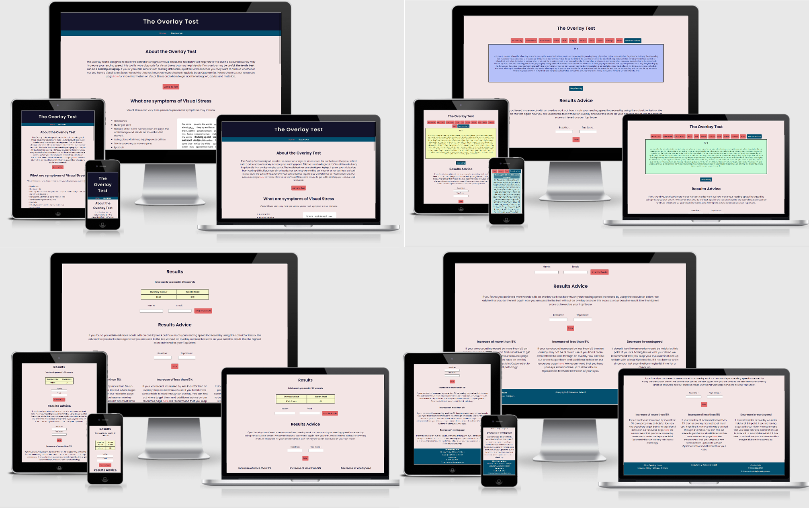
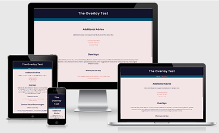

# Overlay Test

[Link to Live Website](https://crypticcaroline.github.io/overlay-test/index.html)

[GitHub Repo](https://github.com/crypticCaroline/overlay-test)

*** 

## About  
Visual Stress is a common condition that affects an estimated 20% of the population.  This causes issues in the visual cortex of the brain which is commonly experienced by people with dyslexia.  Visual stress however is an entirely separate and distinct condition.  Not all people with dyslexia will suffer from Visual stress and not all people with Visual Stress will be dyslexic.   Visual Stress comes in a variety of symptoms including : 
*   Headaches
*   Blurring of print
*   Noticing white "rivers" running down the page. The white background stands out more than text above it.
*   Losing place within text, skipping words or lines
*   Words appearing to move or jump
*   Eyestrain
*   Difficulty in understanding the text being read
*   Glare on page

Research over the last 20 years has show that using a coloured filter can alleviate the symptoms and increase reading speed by up to 38%. 
As a sufferer of Visual Stress and Dyslexia myself I wanted to create a short test that may indicate if a user has Visual Stress and may benefit from the use of a coloured overlay. It was not until I was working in an optician when I was explaining the symptoms of Visual Stress to a patient that I started to wonder whether my own reading issues were caused by Visual stress.  Since being tested I have found a vast improvement with both Coloured Overlays and Colorimetry glasses.   

Currently there is a small choice of online overlay test most of which are basic.   Most involve a start stop timer to measure how long it takes to read a passage, the test can be taken multiple times, but the text passage is the same throughout.  This could lead to test bias as the user starts to memorise the first few lines.   Other options I have found simply demonstrate what it looks like to have an overlay over the text.  Some of these options change the background colour rather than the overlay colour, which yields a different optical result.  

This test does not replace testing done by Optical professionals but may prove a useful tool for users who do not often see an Optometrist or users who may not have considered getting tested. 

## Index – Table of Contents

* [User Experience (UX)](#user-experience) 
* [Features](#features)
* [Designs](#designs)
* [Technologies Used](#technologies-used)
* [Testing](#testing)
* [Known Bugs](#known-bugs)
* [Deployment](#deployment)
* [Acknowledgements](#credit)

*** 

## User Experience (UX)

## Strategy
### User Stories  

#### Reasons a user may visit the website
* Doing research on visual stress either for themselves of for a family member
* Experiencing symptoms of visual stress and want to test themselves / child
* Trying to find out if using an overlay may increase their reading speed

#### Reasons for the website
* Provide information to users about what visual stress is and how to get additional help
* Provide a way of testing for signs of visual stress
* To demonstrate what it looks like to use an overlay
* Spread awareness of visual stress to a wider group of people. 
  

## Scope
#### What a user may expect
* Easy to navigate website
* Good presentation and visually appealing
* Links and functions work as expected
* Users to find information about visual stress
* Have a way to test for visual stress

#### What a user may want 
* A way to check different coloured overlays
* A way to record down scores
* Information about places that offer additional services
* A way to receive their results
* Information about what their results mean 
* To be able to buy overlays
* A way to contact the the company to ask further questions

#### As a developer / business I expect
* To provide an easy to use website
* To give users useful information about visual stress
* To provide a way for users to test to see if they could benefit from an overlay
* To provide the results and be able to send them to the user
* To signpost users to other resources that may be benefical for them 

## Structure

***
The website will consist of two pages:

The homepage which will consist of the test, some information on visual stess, results and results advise. 
The resources page will include links to places to buy overlay and get additional advise and support. The resources page with be fairly small start with but with space and scope to be able to add more features like "Find your local specalist". 

## Designs

## Surface

#### Colour

The colours I have used in the design are a mixture of two shades of blue and two shades of pink.   
I have opted not to use red and green as this can be difficult for people that have a colour deficiency to see.  I used an off-white colour for the text on the dark background in the header and footer to make it stand

I have used black on white text in the testing area.  This is because black writing on a white background can cause the worst symptoms of visual stress.   So, for the purpose of testing for signs of visual stress we want to create an environment where they are most likley to be present. 

I have used another shade of pink for the link hovers. 

I got Inspiration for my colour pallete from [Coolors](https://coolors.co/palettes/trending)

#### Typography 

I have chosen to use a font from [Google fonts](https://fonts.google.com/)  I have used Poppin.  This font is a sans serif font which means it does not have decoration at the end of the letter.  This can cause issues with readability seen in serif fonts.  The Poppins font is fun and playful, and offers nice spacing between the letters as standard.   

I have used the default serif font for the test.  This is to encourage signs and symptoms of visual stress to show when taking the test. 

For the headings I have inccreased the letter spacing to make it stand out. 

I imported using the the following code at the top of my style.css file: 

        @import url('https://fonts.googleapis.com/css2?family=Poppins:wght@200;300;400;&display=swap');

#### Call to Action

* For the buttons and links (styled as buttons)  I have changed the opacity on hover.  This is to show the user that the button can be clicked. 

* I have used changed the colour of the text for the links in the main text to a pink colour, on hover the word gets darker.  Again this lets the user know the link can be clicked. 

* In the test each word is contained within a span, this then changes when the word is hovered over after the test has run. When the test is live or not running you can not click on the word.  This is so the user doesn't get confused whilst taking the test.  

* On the input fields I have used a pointer event to encourage the user to enter a value.  

### Imagery   

I have used an example of visual stress in the main page.  I designed this using  [Microsoft Word](https://www.microsoft.com/en-gb/microsoft-365/word) to give a visual demonstration of what symptoms of visual stress may look like.  This would be particully helpful to teachers or parent running the test with a child.  

***

## Skeleton 

### Layout 

I have used responsive design when creating the testing site.I have also set a Max-Width for the site so on very large screens the content stays neat and is well formatted.
The test runs best on larger screens but will also work on a mobile.  Even though the test is designed for bigger devices I have designed the site mobile first.  As the window is expanded everything is neat and sits in line.  

I have styled containers and added padding and margins to ensure that the content it not too close together and everything can be seen clearely. 

#### Homepage Wire Frame 

#### Resources Wireframe

***

### Mockup
#### Home Page

#### Resources Page

***

## Features

#### Universal Features Across the Site

###### Logo and Navigation Bar

###### Responsiveness

###### Accessibility

###### Footer 

##### Meta data

##### Redirect

*** 

#### Features Specific to Pages

###### Homepage 

###### Testimonial

 

###### Email

### Future Features 

    

***

## Technologies Used 

* HTML5 - Mark-up language using semantic structure.
* CCS3 - Cascading style sheet used to style.
* Gitpod.io - for writing the code. Using the command line for committing and pushing to Git Hub
* GitHub -
* GIT - 
 
Design 

* [Google fonts](https://fonts.google.com/) - 
* [Balsamiq wireframe](https://balsamiq.com/) - 
* [Font Awesome](https://fontawesome.com/) - 
* [Beautifer](https://beautifier.io/) - 
* [Tiny PNG](https://tinypng.com/) – 
Testing 
* [HTML Validator](https://validator.w3.org/) 
* [CSS Validator](https://validator.w3.org/) 
* [IE NetREnderer](https://netrenderer.com/index.php)
* [Am I Responsive](http://ami.responsivedesign.is/#) 
* [Wave](https://wave.webaim.org/) 
* DEV Tools - Lighthouse

***

## Testing 

    
[HTML Validator](https://validator.w3.org/)

[CSS Validator](https://validator.w3.org/)

### Usability Testing

issue with alert blocking - changed to be innerhtml/countdown

[Wave](https://wave.webaim.org/) 
    
### Browser Compatibility

Tested on Chrome, Firefox, Brave, Internet Explorer, Microsoft Edge, Safari.[IE NetREnderer](https://netrenderer.com/index.php) to test the older versions. 

### OS Compatibility
 iOS, Android 10, and Windows 10. -
Tested for responsiveness using Chrome DevTools.

### Performance Testing
Tested on the Developer Tools Lighthouse.  

### Testing User Stories

*** 

## Deployment 

### Adding and Committing files

To add files to the repository take the following steps

In the command line type -
        git add .  
        git commit -m "This is being committed"
        git push

To add all new files or modified file use " ."  - To add a single file use the pathway to the file eg .index.html  or assets/css/style.css
When committing make sure your comments are clear about what changes have been made. 
Pushing will send your work to the repository

### Deployment 

The project was deployed with the following steps

* Logged into git hub
* Clicked the "Settings" button in the menu above the Repository.
* Scroll down the Settings page to the "GitHub Pages" Section.
* Under "Source", click the dropdown called "None" and then select "Master Branch".
* The page will automatically refresh, and a link displaced.  It may take some time for the link to show the website.
* If the page will not load go down to "template" under the "source" and select a template. 
* Scroll back down through the page to locate the now published site link in the "GitHub Pages" section.

### Forking

Forking the GitHub Repository

By forking the GitHub Repository, you can make a copy of the original repository in your own GitHub account.  This means we can view or make changes without making the changes affecting the original.

* Log into GitHub and locate the GitHub Repository.
* At the top of the Repository there is a "Fork" button about the "Settings" button on the menu.
* You should now have a new copy of the original repository in your own GitHub account.

### Cloning 

Making a Local Clone

* Log into your GitHub then find the gitpod repository
* Under the repository name there is a button that says "Clone or download". Click on this button.
* If cloning with HTTPS "Clone with HTTPS", copy this link.
* Open Gitbash
* Change the current working directory to the location where you want the cloned directory to be.
* Type git clone, and then paste the URL you copied earlier.

        $ git clone https://github.com/YOUR-USERNAME/YOUR-REPOSITORY
        Press - Enter- Your local clone will be created.
        $ git clone https://github.com/YOUR-USERNAME/YOUR-REPOSITORY
                > Cloning into `CI-Clone`...
                > remote: Counting objects: 10, done.
                > remote: Compressing objects: 100% (8/8), done.
                > remove: Total 10 (delta 1), reused 10 (delta 1)
                > Unpacking objects: 100% (10/10), done.
[Click Here](https://docs.github.com/en/free-pro-team@latest/github/creating-cloning-and-archiving-repositories/cloning-a-repository) for more info on cloning. 

## Known Bugs 

***

## Acknowledgements

### Credit

*** 

### Code:

### Content:

Code & Content (not already attributed): Rebecca Kelsall

### Inspiration: 

